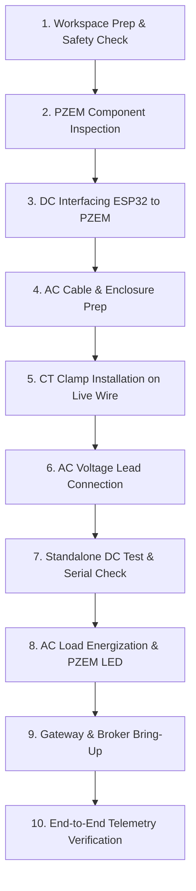

# Hardware Setup & Interfacing Guide
## IoT-Based False Data Injection Attack Detection and Data Recovery for Smart Grid Energy Monitoring

---

### Module Briefing
* **Purpose**: Comprehensive hardware interfacing, electrical wiring, laboratory assembly, static network configuration, and diagnostic verification guide for the Smart Grid FDI Attack Detection and Data Recovery testbed.
* **Target Hardware**:
  * Microcontroller Node: ESP32-WROOM-32 (38-pin DevKit V1)
  * AC Sensing Module: Peacefair PZEM-004T v3.0 (with 100A split-core current transformer)
  * Edge Computing Gateway: Raspberry Pi 4 Model B (4GB/8GB RAM) running Raspberry Pi OS (64-bit)
  * Attack Simulation Host: Linux Laptop (Kali Linux 2024.x / Ubuntu 22.04 LTS)
  * Network Switch / Access Point: 2.4 GHz 802.11 b/g/n Router (WPA2-PSK)
* **Target Environment**: University electrical engineering cybersecurity laboratory testbed.
* **Firmware / Software Dependencies**: Arduino IDE 2.x, ESP32 Arduino Core v2.0+, `PZEM004Tv30` library, Mosquitto MQTT Broker v2.0+, Python 3.9+.
* **Security Disclaimer**: This document accompanies a cybersecurity research testbed intended strictly for academic evaluation of False Data Injection (FDI) attacks and mitigation algorithms under controlled laboratory isolation. All offensive procedures and network topologies must be deployed exclusively inside an isolated subnet without bridging to campus or public infrastructure.

---

## 1. Electrical Architecture & Wiring Specifications

### 1.1 Overview & Theory of Operation
The sensing layer employs the **Peacefair PZEM-004T v3.0** digital power multi-meter IC coupled with an **ESP32-WROOM-32** microcontroller. 
* **AC Side**: Measures RMS Voltage ($80\text{--}260\text{ VAC}$), RMS Current ($0\text{--}100\text{ A}$ via external Current Transformer), Active Power ($0\text{--}23\text{ kW}$), Active Energy ($0\text{--}9999.99\text{ kWh}$), Grid Frequency ($45\text{--}65\text{ Hz}$), and Power Factor ($0.00\text{--}1.00$).
* **Galvanic Isolation**: The PZEM-004T board incorporates high-speed optocouplers (`EL817` / `PC817`) providing electrical isolation between the dangerous high-voltage AC measurement circuitry (SD3004 / RN8208G ASIC) and the low-voltage DC logic interface.
* **DC Logic Level**: The PZEM-004T communication header requires a steady $5\text{ V}$ rail on its $V_{\text{CC}}$ pin to properly bias the phototransistors in the optical couplers. Communication is conducted via UART using the standard Modbus-RTU protocol at 9600 baud, 8 data bits, 1 stop bit, no parity.

```
       +-----------------------------------------------------------+
       |                  HIGH-VOLTAGE AC MAINS (230V)             |
       |                                                           |
       |     [LIVE] ----------------( CT CLAMP )-----> [LOAD]      |
       |        |                       |                 |        |
       |        +--[1A FUSE]--+         |                 |        |
       |                      |         |                 |        |
       |     [NEUTRAL] -------|---------|-----------------+        |
       +----------------------|---------|--------------------------+
                              |         |
                              v         v
                     +--------L---------CT1--+
                     |          PZEM-004T    |
                     |          v3.0 Board   |
                     |  (Optically Isolated) |
                     +--5V---GND---TX---RX---+
                         |    |     |    |
                         |    |     |    +-----------+
                         |    |     +------+         |
                         |    |            |         |
                         v    v            v         v
                     +--VIN--GND---------GPIO16---GPIO17--+
                     |                   (RX2)    (TX2)   |
                     |               ESP32-WROOM-32       |
                     |                 Node 01            |
                     +------------------------------------+
```

---

### 1.2 DC Wiring Table (PZEM-004T ↔ ESP32)

> [!IMPORTANT]
> The PZEM-004T requires $5\text{ V}$ on its $V_{\text{CC}}$ pin. While the ESP32 operates at $3.3\text{ V}$ logic, the PZEM-004T v3.0 optocoupler inputs/outputs operate reliably with the ESP32 HardwareSerial pins (UART2) without an external logic level shifter because the PZEM's TX optocoupler pulls up to the logic reference, and the ESP32's $3.3\text{ V}$ output on GPIO17 provides sufficient forward current to drive the PZEM's RX photodiode.

| PZEM-004T Pin | ESP32 Pin | Wire Color | Wire Gauge | Description & Electrical Notes |
|---|---|---|---|---|
| **5V** | **VIN (5V)** | Red | 24 AWG | Regulated DC power input for PZEM optocoupler transceiver. Connected to ESP32 VIN (powered by 5V USB bus). |
| **GND** | **GND** | Black | 24 AWG | Common DC signal ground reference between ESP32 and PZEM logic stage. |
| **TX** | **GPIO16 (RX2)** | Yellow | 24 AWG | PZEM Transmit $\rightarrow$ ESP32 Receive. Hardware UART2 RX pin. Cross-connected. |
| **RX** | **GPIO17 (TX2)** | Green | 24 AWG | ESP32 Transmit $\rightarrow$ PZEM Receive. Hardware UART2 TX pin. Cross-connected. |

---

### 1.3 AC High-Voltage Side Wiring Table

| Terminal Mark | Connection Target | Wire Color | Specification | Notes & Guidelines |
|---|---|---|---|---|
| **L** | AC Mains 230V Live / Phase | Brown / Red | 1.0 mm² (17 AWG) Copper | Voltage sampling feed. Must have an inline $0.5\text{ A}$ to $1.0\text{ A}$ fast-acting ceramic fuse. |
| **N** | AC Mains 230V Neutral | Blue / Black | 1.0 mm² (17 AWG) Copper | Neutral reference for voltage measurement. Connects directly to AC neutral bar. |
| **CT-1** | Current Transformer Lead 1 | White | Pre-attached twisted pair | Differential CT secondary coil connection. |
| **CT-2** | Current Transformer Lead 2 | Blue / Black | Pre-attached twisted pair | Differential CT secondary coil connection. (Polarity dictates power flow sign). |

---

### 1.4 High-Voltage Safety Precautions

> [!CAUTION]
> **LETHAL VOLTAGE WARNING: 230V AC CAN CAUSE SEVERE INJURY, PERMANENT DISABILITY, OR INSTANT ELECTROCUTION.**
> 1. **Complete De-energization**: ALWAYS ensure the AC test cable is completely unplugged from the wall socket and upstream double-pole circuit breaker is locked off before touching any screw terminal or conductor.
> 2. **Sequence Rule**: Always wire and inspect the low-voltage DC stage (ESP32 $\leftrightarrow$ PZEM) FIRST. Only wire the AC high-voltage stage once DC wiring is verified and mechanically secured.
> 3. **Single Conductor CT Clamping**: The split-core Current Transformer (CT) MUST clamp around **ONLY ONE conductor** (the Live wire). Clamping around both Live and Neutral simultaneously results in mutual flux cancellation ($I_{\text{Live}} + I_{\text{Neutral}} \approx 0$), resulting in $0.00\text{ A}$ current readings.
> 4. **Physical Enclosure**: House all AC terminals, the PZEM-004T module, and the fused breakout inside an IP54-rated flame-retardant ABS project box. No exposed AC copper should be reachable by human fingers during lab trials.
> 5. **Residual Current Device (RCD / GFCI)**: Supply the entire testbed through an external $30\text{ mA}$ RCD (Residual Current Device) or Class A GFCI adapter.

---

## 2. Testbed Network Architecture

The experimental smart grid testbed is deployed on a dedicated, air-gapped subnet (`192.168.1.0/24`). Static IP allocation prevents DHCP lease churn, race conditions during bootup, and ensures reproducible ARP tables for security experiments.

```
                            +-------------------------------+
                            |        Wi-Fi / Ethernet       |
                            |         Router / AP           |
                            |         192.168.1.1           |
                            +---------------+---------------+
                                            |
         +----------------------------------+----------------------------------+
         |                                  |                                  |
         v (Wi-Fi 2.4 GHz)                  v (Gigabit Eth / Wi-Fi)            v (Gigabit Ethernet)
+-------------------+              +-------------------+              +-------------------+
|   ESP32 Node 01   |              |  Raspberry Pi 4   |              |  Attacker Laptop  |
|   esp32-node01    |              |    pi-gateway     |              |    attacker-pc    |
|   192.168.1.101   |              |   192.168.1.100   |              |   192.168.1.200   |
| (MQTT Publisher)  |              |  (Broker + Edge)  |              | (MITM / FDI Inject)|
+-------------------+              +-------------------+              +-------------------+
```

### 2.1 Network Configuration Matrix

| Device | Hostname | Static IP | Subnet Mask | Gateway | Interface | Role in Architecture |
|---|---|---|---|---|---|---|
| **Home / Lab Router** | `router` | `192.168.1.1` | `255.255.255.0` | N/A | LAN / WLAN | Subnet gateway, DNS forwarder, Layer-2 switch |
| **Raspberry Pi 4** | `pi-gateway` | `192.168.1.100` | `255.255.255.0` | `192.168.1.1` | `eth0` / `wlan0` | Mosquitto MQTT Broker (port 1883), FDI Detector, Data Recovery Engine |
| **ESP32 WROOM-32** | `esp32-node01` | `192.168.1.101` | `255.255.255.0` | `192.168.1.1` | Wi-Fi (802.11b/g/n) | Edge Sensor Node: samples PZEM, computes HMAC-SHA256, publishes JSON telemetry |
| **Attacker Laptop** | `attacker-pc` | `192.168.1.200` | `255.255.255.0` | `192.168.1.1` | `eth0` / `wlan0` | Security evaluation host: ARP spoofing, packet sniffing, stealth FDI injection |

### 2.2 Protocol & Cryptographic Parameters
* **Broker Port**: `1883` (Standard MQTT TCP unencrypted for cleartext vulnerability baseline)
* **Telemetry Topic**: `smartgrid/node01/telemetry`
* **Control / Alert Topic**: `smartgrid/node01/alerts`
* **HMAC Secret Key**: `smartgrid_secret_key_2025`
* **HMAC Algorithm**: HMAC-SHA256 (calculated over concatenated telemetry string `timestamp,voltage,current,power,energy,frequency,power_factor`)

---

## 3. Step-by-Step Assembly Procedure

Follow these ten sequential steps strictly. Do not apply AC power until Step 7 has passed all preliminary checks.



### Step 1: Workspace Preparation & Safety Gear
1. Clear the workbench of clutter, conductive swarf, and moisture. Lay down an antistatic, non-conductive rubber work mat.
2. Put on ANSI-approved safety glasses.
3. Have a digital multimeter (CAT III 600V rated) with sharp probe tips ready.
4. Ensure the AC power strip is connected to an active Residual Current Device (RCD / GFCI) and switch is **OFF**.

### Step 2: PZEM-004T v3.0 Physical Inspection
1. Verify the module marking: Confirm it is **PZEM-004T v3.0** (featuring the 4-pin DC header and 4-screw AC terminal block).
2. Inspect the 100A split-core current transformer. Confirm that the core mating surfaces are clean, free of dust, and that the latch snaps shut firmly.
3. Check the PCB for solder bridges or loose screw terminal blocks.

### Step 3: DC Side Wiring (PZEM-004T ↔ ESP32)
1. Using female-to-female Dupont jumper wires (24 AWG):
   * Connect PZEM-004T **5V** to ESP32 **VIN**.
   * Connect PZEM-004T **GND** to ESP32 **GND**.
   * Connect PZEM-004T **TX** to ESP32 **GPIO16** (RX2).
   * Connect PZEM-004T **RX** to ESP32 **GPIO17** (TX2).
2. Secure the wires together using spiral wrap or a nylon cable tie to prevent loose leads from touching high-voltage zones.

### Step 4: AC Test Rig & Safety Enclosure Preparation
1. Strip an AC 3-core power cord (containing Live, Neutral, and Earth conductors).
2. Strip approximately $8\text{ mm}$ of insulation from the ends of the Live (Brown) and Neutral (Blue) conductors. Crimp bootlace ferrules onto stranded wire ends to prevent stray strands from bridging terminals.
3. Wire an inline $1\text{ A}$ fast-blow $5\times20\text{ mm}$ glass/ceramic fuse holder into the Live branch.

### Step 5: CT Clamp Installation
1. Route the AC Live (Brown) wire through the aperture of the 100A Current Transformer clamp.
2. Snap the CT latch completely shut. Listen for the physical click.
3. **Verify**: Ensure the Neutral (Blue) and Earth (Green/Yellow) wires bypass the outside of the CT clamp and do **NOT** pass through the core.
4. Insert the two secondary leads from the CT clamp into the PZEM terminals marked **CT-1** and **CT-2**. Tighten the screw terminals with an insulated precision flathead screwdriver.

### Step 6: AC Voltage Sensing Connections
1. Insert the fused Live wire into the PZEM terminal marked **L**. Tighten the terminal screw.
2. Insert the Neutral wire into the PZEM terminal marked **N**. Tighten the terminal screw.
3. Tug gently on each wire to confirm mechanical retention.
4. Mount the PZEM-004T board and all exposed AC terminations firmly inside an insulated ABS project enclosure. Secure the lid using screws.

### Step 7: Standalone DC Power & Hardware Test
1. **Leave the AC plug disconnected.**
2. Connect the ESP32 to your PC via a Micro-USB data cable.
3. Verify that the ESP32 red power LED illuminates.
4. Check with a multimeter: Measure DC voltage between ESP32 **VIN** and **GND**. Confirm reading is $+4.8\text{ V}$ to $+5.2\text{ V}$.
5. Measure DC voltage across PZEM header pins **5V** and **GND**. Confirm reading matches $+5\text{ V}$.

### Step 8: Standalone AC Load Test
1. Connect a known resistive test load (e.g., a $60\text{ W}$ incandescent bulb or a domestic space heater on low setting) to the output socket of your test cord.
2. Plug the AC test cable into the RCD-protected mains socket.
3. Switch the mains switch **ON**.
4. Observe the PZEM-004T status LED: A small LED on the PZEM-004T PCB will blink intermittently or pulse when actively sensing AC mains.
5. Using your multimeter in AC Volts mode (CAT III rated), verify mains voltage across L and N terminals inside the junction box ($220\text{--}240\text{ VAC}$).

### Step 9: Network Infrastructure Bring-Up
1. Power on the Wi-Fi Router / Access Point. Confirm SSID `SmartGrid_Lab_AP` is broadcasting.
2. Boot the Raspberry Pi 4 Gateway.
3. Log in to the Raspberry Pi and verify the Mosquitto MQTT broker is active:
   ```bash
   sudo systemctl status mosquitto
   ```
4. Verify port 1883 is listening across all interfaces:
   ```bash
   ss -tulpn | grep 1883
   ```

### Step 10: End-to-End System Verification
1. Flash the ESP32 with the telemetry firmware (configured for static IP `192.168.1.101`).
2. Open the Arduino Serial Monitor at 115200 baud. Confirm Wi-Fi connection and valid sensor readings.
3. On the Raspberry Pi, subscribe to the MQTT topic:
   ```bash
   mosquitto_sub -h 192.168.1.100 -t 'smartgrid/node01/telemetry' -v
   ```
4. Confirm JSON telemetry messages containing valid voltage, current, power, and HMAC tokens are printed every 1 second.

---

## 4. Verification Checklist & Diagnostics

Before running FDI attack and detection experiments, systematically execute each verification procedure below and check off each item.

```
[ ] Diagnostic 4.1: Standalone PZEM-004T UART Diagnostic with USB-TTL Adapter
[ ] Diagnostic 4.2: ESP32 Wi-Fi Association & Serial Readout
[ ] Diagnostic 4.3: Mosquitto MQTT Broker Local & Remote Ingestion
[ ] Diagnostic 4.4: Subnet Reachability & Cross-Node Ping Matrix
```

---

### Diagnostic 4.1: Standalone PZEM-004T UART Test (USB-TTL Adapter)
If the ESP32 fails to read telemetry, isolate the PZEM-004T using a USB-to-UART bridge (FTDI FT232RL or CP2102) connected to a laptop:

```
+----------------+          +-------------------+
|  USB-TTL (5V)  |          |   PZEM-004T v3.0  |
|      5V        | -------->|        5V         |
|      GND       | -------->|        GND        |
|      TXD       | -------->|        RX         |
|      RXD       | -------->|        TX         |
+----------------+          +-------------------+
```

#### Standalone Diagnostic Python Script (`test_pzem_direct.py`)
Run this script on your laptop with the USB-TTL adapter plugged into `/dev/ttyUSB0` (Linux) or `COM3` (Windows):

```python
#!/usr/bin/env python3
"""
Standalone Diagnostic Tool: Direct PZEM-004T v3.0 Query via USB-TTL Adapter
Sends Modbus-RTU command 0x04 (Read Input Registers) to slave address 0x01.
"""

import sys
import time
import serial

# Configure serial port (Update 'COM3' or '/dev/ttyUSB0' as per system)
SERIAL_PORT = "/dev/ttyUSB0" if sys.platform.startswith("linux") else "COM3"
BAUD_RATE = 9600

# Modbus-RTU Frame: Slave 0x01, Function 0x04, Start Register 0x0000, 10 Registers, CRC16: 0x70 0x0D
QUERY_FRAME = bytes([0x01, 0x04, 0x00, 0x00, 0x00, 0x0A, 0x70, 0x0D])

def main():
    print(f"[*] Opening serial port {SERIAL_PORT} at {BAUD_RATE} baud...")
    try:
        ser = serial.Serial(
            port=SERIAL_PORT,
            baudrate=BAUD_RATE,
            parity=serial.PARITY_NONE,
            stopbits=serial.STOPBITS_ONE,
            bytesize=serial.EIGHTBITS,
            timeout=1.5
        )
    except Exception as e:
        print(f"[!] Error opening serial port: {e}")
        return

    print("[*] Port opened. Sending Modbus-RTU read query frame...")
    ser.write(QUERY_FRAME)
    time.sleep(0.2)

    response = ser.read(25)
    ser.close()

    if len(response) < 25:
        print(f"[!] Warning: Received incomplete response ({len(response)} bytes).")
        print(f"[!] Raw bytes: {response.hex()}")
        print("[!] Check: Is AC high-voltage mains connected to L & N? PZEM chip requires AC power!")
        return

    print(f"[+] Success! Received {len(response)} bytes: {response.hex()}")
    
    # Parse PZEM-004T v3.0 Modbus Response Payload:
    # Bytes 3-4: Voltage (0.1V resolution)
    voltage_raw = int.from_bytes(response[3:5], byteorder="big")
    voltage = voltage_raw * 0.1

    # Bytes 5-8: Current (0.001A resolution)
    current_raw = int.from_bytes(response[5:9], byteorder="big")
    current = current_raw * 0.001

    # Bytes 9-12: Power (0.1W resolution)
    power_raw = int.from_bytes(response[9:13], byteorder="big")
    power = power_raw * 0.1

    # Bytes 13-16: Energy (1Wh resolution)
    energy_raw = int.from_bytes(response[13:17], byteorder="big")

    # Bytes 17-18: Frequency (0.1Hz resolution)
    freq_raw = int.from_bytes(response[17:19], byteorder="big")
    frequency = freq_raw * 0.1

    # Bytes 19-20: Power Factor (0.01 resolution)
    pf_raw = int.from_bytes(response[19:21], byteorder="big")
    power_factor = pf_raw * 0.01

    print("\n--- PZEM-004T Direct Measurement ---")
    print(f"  Voltage      : {voltage:.1f} V")
    print(f"  Current      : {current:.3f} A")
    print(f"  Active Power : {power:.1f} W")
    print(f"  Energy       : {energy_raw} Wh")
    print(f"  Frequency    : {frequency:.1f} Hz")
    print(f"  Power Factor : {power_factor:.2f}")
    print("------------------------------------\n")

if __name__ == "__main__":
    main()
```

---

### Diagnostic 4.2: ESP32 Wi-Fi & Sensor Verification via Serial Monitor
Connect the ESP32 to the PC and launch Arduino Serial Monitor at **115200 baud**. You should observe the following sequence:

```
[SYSTEM] ESP32 Smart Grid Sensor Node 01 Booting...
[SYSTEM] Reset Reason: Power on reset
[NETWORK] Configuring Static IP: 192.168.1.101
[NETWORK] Connecting to SSID: SmartGrid_Lab_AP ....
[NETWORK] Wi-Fi connected successfully!
[NETWORK] IP Address: 192.168.1.101 | Subnet: 255.255.255.0 | Gateway: 192.168.1.1
[NETWORK] RSSI: -54 dBm
[PZEM] Initializing PZEM-004T v3.0 on UART2 (RX: GPIO16, TX: GPIO17)...
[PZEM] Initial probe successful! Grid Voltage: 231.4 V
[MQTT] Connecting to broker: 192.168.1.100:1883 ... Connected!
[TELEMETRY] Published seq=1 | V=231.4V, I=0.452A, P=104.3W, E=12Wh, F=50.0Hz, PF=0.99 | HMAC: a4f8...b3
```

---

### Diagnostic 4.3: Mosquitto MQTT Broker Verification on Raspberry Pi

1. **Verify Broker Service Status**:
   ```bash
   pi@pi-gateway:~ $ sudo systemctl status mosquitto
   ```
   *Expected Output*: `Active: active (running)`

2. **Verify Broker Network Listener**:
   ```bash
   pi@pi-gateway:~ $ ss -tulpn | grep 1883
   ```
   *Expected Output*: `tcp LISTEN 0 100 0.0.0.0:1883 0.0.0.0:* users:(("mosquitto",pid=...,fd=5))`

3. **Verify Local Loopback Ingestion**:
   Terminal A:
   ```bash
   mosquitto_sub -h 127.0.0.1 -t "smartgrid/test" -v
   ```
   Terminal B:
   ```bash
   mosquitto_pub -h 127.0.0.1 -t "smartgrid/test" -m "broker_self_test_ok"
   ```
   *Expected Outcome*: Terminal A prints `smartgrid/test broker_self_test_ok`.

4. **Monitor Real-Time ESP32 Telemetry**:
   ```bash
   pi@pi-gateway:~ $ mosquitto_sub -h 192.168.1.100 -t 'smartgrid/node01/telemetry' -v
   ```
   *Expected Real Output*:
   ```json
   smartgrid/node01/telemetry {"node_id":"node01","seq":42,"timestamp":1725431661,"voltage":231.5,"current":0.456,"power":105.1,"energy":0.015,"frequency":50.0,"power_factor":0.99,"hmac":"7c89f2a48b59e3d81b94bca4e65dbd6b5e17da9d816a760f38eb4132890dbd8a"}
   ```

---

### Diagnostic 4.4: Subnet Reachability & Cross-Node Ping Matrix

From the **Attacker Laptop** (`192.168.1.200`), test connectivity across all subnet members:

```bash
# Test Router Gateway
ping -c 3 192.168.1.1

# Test Raspberry Pi Gateway & Broker
ping -c 3 192.168.1.100

# Test ESP32 Sensor Node
ping -c 3 192.168.1.101
```

#### Ping Matrix Reference
| Source Node | Destination | Command | Acceptable RTT | Pass Criteria |
|---|---|---|---|---|
| `attacker-pc` (192.168.1.200) | `pi-gateway` (192.168.1.100) | `ping -c 5 192.168.1.100` | $< 2\text{ ms}$ (Ethernet) | 0% packet loss |
| `attacker-pc` (192.168.1.200) | `esp32-node01` (192.168.1.101) | `ping -c 5 192.168.1.101` | $< 25\text{ ms}$ (Wi-Fi) | 0% packet loss |
| `pi-gateway` (192.168.1.100) | `esp32-node01` (192.168.1.101) | `ping -c 5 192.168.1.101` | $< 25\text{ ms}$ (Wi-Fi) | 0% packet loss |

---

## 5. Static IP Configuration Guide

### 5.1 ESP32 Firmware Implementation (`WiFi.config()`)
The ESP32 firmware configures its static IP stack before initiating association with the 802.11 access point.

```cpp
#include <WiFi.h>

// Static IP Configuration Parameters
const IPAddress local_IP(192, 168, 1, 101);      // Desired static IP
const IPAddress gateway(192, 168, 1, 1);          // Default subnet gateway
const IPAddress subnet(255, 255, 255, 0);         // Subnet mask /24
const IPAddress primaryDNS(192, 168, 1, 1);       // Primary DNS resolver
const IPAddress secondaryDNS(8, 8, 8, 8);         // Fallback DNS

const char* ssid     = "SmartGrid_Lab_AP";
const char* password = "LabSecurePassword2025!";

void setupWiFi() {
    Serial.println("\n[NETWORK] Initializing Static IP Configuration...");
    
    // Disable AP mode and set Wi-Fi station mode
    WiFi.mode(WIFI_STA);
    
    // IMPORTANT: WiFi.config() MUST be called BEFORE WiFi.begin()
    if (!WiFi.config(local_IP, gateway, subnet, primaryDNS, secondaryDNS)) {
        Serial.println("[NETWORK] ERROR: Static IP configuration failed to apply!");
    }
    
    WiFi.begin(ssid, password);
    
    Serial.print("[NETWORK] Connecting to AP");
    int attempts = 0;
    while (WiFi.status() != WL_CONNECTED && attempts < 30) {
        delay(500);
        Serial.print(".");
        attempts++;
    }
    
    if (WiFi.status() == WL_CONNECTED) {
        Serial.println("\n[NETWORK] Successfully associated with Access Point.");
        Serial.print("[NETWORK] Assigned IP Address : ");
        Serial.println(WiFi.localIP());
        Serial.print("[NETWORK] Subnet Mask         : ");
        Serial.println(WiFi.subnetMask());
        Serial.print("[NETWORK] Default Gateway     : ");
        Serial.println(WiFi.gatewayIP());
        Serial.print("[NETWORK] Received RSSI       : ");
        Serial.print(WiFi.RSSI());
        Serial.println(" dBm");
    } else {
        Serial.println("\n[NETWORK] CRITICAL: Wi-Fi connection timed out. Check AP SSID/Key!");
    }
}
```

---

### 5.2 Raspberry Pi 4 Gateway Static IP Configuration

Depending on the version of Raspberry Pi OS running on your Pi 4, configure either NetworkManager (Pi OS Bookworm) or `dhcpcd` (Pi OS Bullseye/Legacy).

#### Method A: Raspberry Pi OS Bookworm (NetworkManager / `nmcli`) - Recommended
```bash
# 1. Identify network connection name
nmcli connection show

# 2. Configure static IP on eth0 (Ethernet interface)
sudo nmcli connection modify "Wired connection 1" \
    ipv4.method manual \
    ipv4.addresses 192.168.1.100/24 \
    ipv4.gateway 192.168.1.1 \
    ipv4.dns "192.168.1.1 8.8.8.8"

# 3. Reactivate connection
sudo nmcli connection up "Wired connection 1"
```

#### Method B: Raspberry Pi OS Bullseye / Legacy (`/etc/dhcpcd.conf`)
Append the following block to the bottom of `/etc/dhcpcd.conf`:

```ini
# Smart Grid Gateway Static IP Configuration
interface eth0
static ip_address=192.168.1.100/24
static routers=192.168.1.1
static domain_name_servers=192.168.1.1 8.8.8.8

# If using Wi-Fi (wlan0) instead of Ethernet:
# interface wlan0
# static ip_address=192.168.1.100/24
# static routers=192.168.1.1
# static domain_name_servers=192.168.1.1 8.8.8.8
```

Restart the network daemon to apply:
```bash
sudo systemctl restart dhcpcd
```

#### Mosquitto Broker Binding Configuration (`/etc/mosquitto/conf.d/smartgrid.conf`)
Modern Mosquitto versions (v2.0+) reject external network connections by default unless explicitly configured:

```ini
# /etc/mosquitto/conf.d/smartgrid.conf
listener 1883 0.0.0.0
allow_anonymous true
persistence true
persistence_location /var/lib/mosquitto/
log_dest file /var/log/mosquitto/mosquitto.log
log_type error
log_type warning
log_type notice
log_type information
```
Restart Mosquitto:
```bash
sudo systemctl restart mosquitto
```

---

### 5.3 Attacker Laptop Static IP Setup (Linux / Kali / Ubuntu)

#### Option 1: Ubuntu Netplan (`/etc/netplan/01-netcfg.yaml`)
Create or edit `/etc/netplan/01-netcfg.yaml`:

```yaml
network:
  version: 2
  renderer: networkd
  ethernets:
    eth0:
      dhcp4: no
      addresses:
        - 192.168.1.200/24
      routes:
        - to: default
          via: 192.168.1.1
      nameservers:
        addresses:
          - 192.168.1.1
          - 8.8.8.8
```
Apply the netplan configuration:
```bash
sudo netplan generate
sudo netplan apply
```

#### Option 2: Kali Linux / NetworkManager CLI (`nmcli`)
```bash
# Configure static IP for eth0 on Kali Linux
sudo nmcli con mod "Wired connection 1" \
    ipv4.method manual \
    ipv4.addresses 192.168.1.200/24 \
    ipv4.gateway 192.168.1.1 \
    ipv4.dns "192.168.1.1,8.8.8.8"

sudo nmcli con up "Wired connection 1"
```

Verify IP assignment:
```bash
ip addr show eth0
```

---

## 6. Comprehensive Troubleshooting Guide

| Symptom | Probable Cause | Diagnostic Test | Definitive Solution |
|---|---|---|---|
| **PZEM returns `NaN` or `0.0V` for all measurements** | 1. AC high-voltage mains are not connected to L/N screw terminals.<br>2. RX and TX lines are swapped.<br>3. Loose 5V/GND DC power wire. | 1. Measure AC voltage across L and N terminals with CAT III multimeter.<br>2. Swap Yellow (RX2) and Green (TX2) jumper wires.<br>3. Check DC voltage between PZEM 5V and GND. | 1. Connect AC test cable to live 230V mains; PZEM metering chip powers from the AC side!<br>2. Connect PZEM TX $\rightarrow$ ESP32 RX2 (GPIO16) and PZEM RX $\rightarrow$ ESP32 TX2 (GPIO17).<br>3. Ensure 5V DC rail provides solid $\ge 4.8\text{ V}$. |
| **Voltage reads ~230V, but Current reads `0.000A` with load active** | 1. CT clamp is clamped around BOTH Live and Neutral conductors.<br>2. CT clamp is not snapped fully shut.<br>3. Load current is below PZEM minimum sensitivity ($< 0.02\text{ A}$ / $< 5\text{ W}$). | 1. Visually check if cable passing through CT has multiple cores.<br>2. Inspect CT latch for gap.<br>3. Measure load wattage. | 1. Strip the outer cord sheath and snap the CT clamp around **ONLY the Live conductor**.<br>2. Firmly press CT clamp until latch audibly clicks.<br>3. Use a load of at least $40\text{--}60\text{ W}$ ($> 0.2\text{ A}$). |
| **Power shows negative or power factor reads `0.00`** | CT secondary leads connected in reverse polarity. | Swap CT-1 and CT-2 terminal leads. | PZEM v3.0 automatically handles bidirectional power, but reversing the CT leads ensures positive quadrant power flow alignment. |
| **ESP32 continuously reboots (Brownout detector triggered)** | 1. Insufficient current from PC USB port when ESP32 activates Wi-Fi radio (~500mA transient spikes).<br>2. Long/low-quality USB cable causing $V_{\text{drop}}$. | Observe Serial Monitor at 115200 baud for: `Brownout detector was triggered`. | 1. Connect ESP32 to a powered USB 3.0 hub or dedicated $5\text{ V} / 2\text{ A}$ power adapter.<br>2. Solder a $100\,\mu\text{F}$ electrolytic capacitor across ESP32 `VIN` and `GND`.<br>3. Replace USB cable with high-gauge short cable. |
| **ESP32 fails to connect to Wi-Fi (`WL_NO_SSID_AVAIL` / Timeout)** | 1. Router is operating solely on 5 GHz band.<br>2. SSID/Password mismatch.<br>3. Static IP conflict with another host. | 1. Check router Wi-Fi settings for 2.4 GHz band broadcast.<br>2. Check serial monitor error log. | 1. ESP32 hardware **only supports 2.4 GHz** (802.11 b/g/n). Enable a dedicated 2.4 GHz SSID on the router.<br>2. Verify WPA2 credentials in firmware.<br>3. Check router client table for IP collision at `192.168.1.101`. |
| **Raspberry Pi Mosquitto rejects connection (`Connection refused` or drops)** | Mosquitto 2.0+ default security prevents remote unauthenticated connections. | Run `mosquitto_sub -h 192.168.1.100 -t test` from external host. | Add `listener 1883 0.0.0.0` and `allow_anonymous true` to `/etc/mosquitto/conf.d/smartgrid.conf` and run `sudo systemctl restart mosquitto`. |
| **PZEM-004T optical LED does not blink** | 1. Blown inline 1A fuse on AC Live feed.<br>2. Optical coupler not receiving DC 5V bias. | 1. Multimeter continuity test on the 1A fuse.<br>2. Multimeter DC test on PZEM 5V/GND terminals. | 1. Replace blown fuse with $1\text{ A}$ fast-acting ceramic fuse.<br>2. Verify ESP32 VIN pin is supplying $\approx 5\text{ V}$ from USB bus. |
| **High packet latency or drops during attack simulation** | ARP cache corruption on router or switch due to aggressive ARP spoofing. | Check `arp -n` on Raspberry Pi and laptop. | Isolate testbed to an unmanaged 4-port Gigabit switch or dedicated AP. Reduce ARP poison frequency from `100 Hz` to `2 Hz`. |

---

## 7. Laboratory Maintenance & Safe Shutdown Routine

To ensure equipment longevity and prevent electrical accidents during multi-user laboratory sessions, follow this standardized shutdown procedure:

1. **De-energize AC Test Load**: Turn off the test load switch.
2. **Disconnect AC Mains**: Unplug the main AC power cord from the wall outlet or trip the bench RCD circuit breaker.
3. **Verify Zero Voltage**: Use a non-contact AC voltage tester or multimeter across L and N terminals to confirm zero potential ($< 5\text{ VAC}$).
4. **Shutdown Gateway**: Safely shutdown the Raspberry Pi gateway from the terminal:
   ```bash
   sudo poweroff
   ```
5. **Disconnect DC USB Power**: Unplug the Micro-USB cable from the ESP32.
6. **Store Test Rig**: Secure the closed ABS project box with the CT clamp attached. Never store the testbed with exposed AC copper leads.
